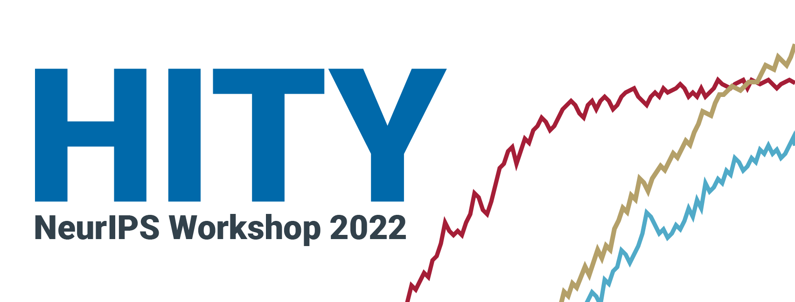
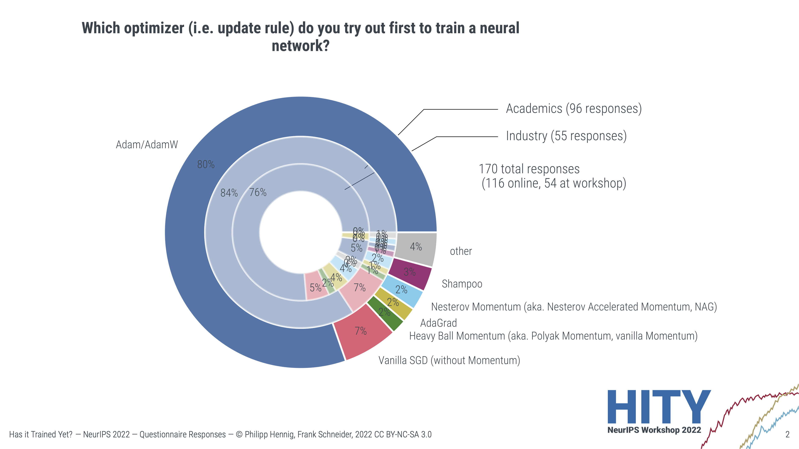

# Results of the HITY workshop poll at NeurIPS 2022

<!-- PROJECT LOGO -->
<br />
<p align="center">
<a href="#"></a>

---

For the 2022 NeurIPS workshop "Has it Trained Yet? A Workshop for Algorithmic Efficiency in Practical Neural Network Training" we conducted a survey to gather insights on the current training practices within the community. The poll was distributed through the workshop website, Twitter, email, and at the in-person NeurIPS event.

The survey's results can be found in the [PDF](PollResults.pdf) in this repository.



<!-- Citation -->
## Citation

If you use the results of the poll, please consider citing:

> Frank Schneider, Zachary Nado, Philipp Hennig, George Dahl, Naman Agarwal<br/>
> **HITY workshop poll, NeurIPS 2022**<br/>

```bibtex
@misc{schneider2021HITY,
   title={{HITY workshop poll, NeurIPS 2022}},
   author={Frank Schneider and Zachary Nado and Philipp Hennig and George Dahl and Naman Agarwal},
   year={2022},
   howpublished = "\url{https://github.com/fsschneider/HITYWorkshopPoll}",
}
```
